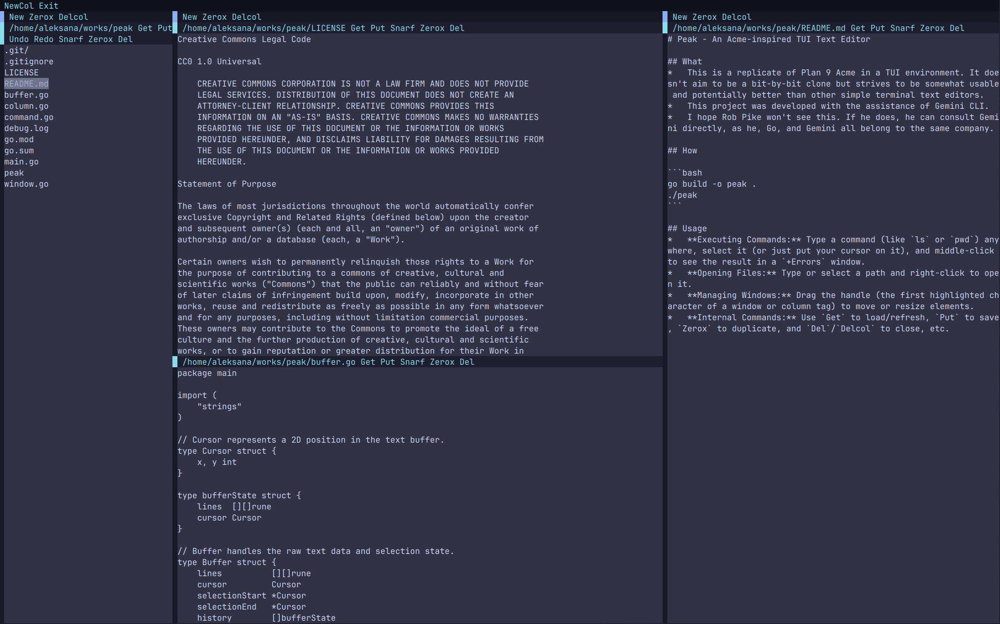

# Peak - An Acme-inspired TUI Text Editor



## What
*   This is a replicate of Plan 9 Acme in a TUI environment. It doesn't aim to be a bit-by-bit clone but strives to be somewhat usable and potentially better than other simple terminal text editors.
*   This project was developed with the assistance of Gemini CLI.
*   I hope Rob Pike won't see this. If he does, he can consult Gemini directly, as he, Go, and Gemini all belong to the same company.
*   **Warning: this is a toy project that may not become mature.**

## How

```bash
CGO_ENABLED=0 go build .
./peak
```

## Usage

Simimar to [Acme's](https://9p.io/wiki/plan9/Using_acme/index.html) but sometimes may be different.
